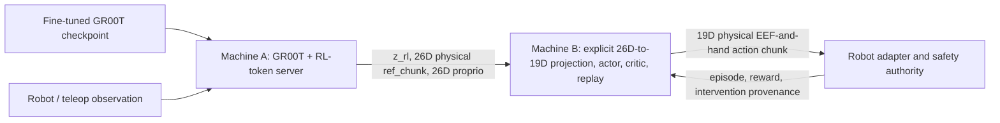

# Groot-RLT

`Groot-RLT` is the GR00T-first integration of **RL Token (RLT)** in this
repository. Its primary target is a fine-tuned Isaac-GR00T policy: train the
compact RL-token representation, serve a frozen GR00T reference policy, build
provenance-rich replay, and train a lightweight chunk actor/critic around the
reference action.

The old openpi implementation is still kept as a legacy/reference backend, but
it is no longer the recommended entry point for this checkout.

## Current status

| Area | Status | Entry point |
| --- | --- | --- |
| GR00T/Cosmos RL-token training and evaluation | Implemented | `groot-rlt train-token`, `groot-rlt evaluate-token` |
| GR00T feature/reference serving | Implemented for the current N1.7 APIs | `groot-rlt serve-features` |
| Episode schema, replay, PyTorch actor/critic and trainer | Implemented and unit-tested | `groot_rlt` Python API |
| Machine-B online learner/replay/actor runtime | GR00T-compatible wire contract | `rlt_online_rl/` |
| GR00T/Nero real-robot rollout adapter | Not yet validated end to end | explicit future adapter |
| `node0:~/Teleop` integration | Contract reviewed; live adapter intentionally not enabled | [teleop integration notes](docs/groot_teleop_integration.md) |

The distinction in the last two rows is important: a feature server and an
online learner are available, but this repository does not yet claim a safe,
validated GR00T real-robot training launch. Robot command ownership, action
layout, normalization, reset, reward, and human-takeover semantics must all be
configured and checked for the target system first.

## Architecture



The current inference rotation contract is authoritative: every EEF rot6d uses
the first two rotation-matrix rows in this order:

```text
[r00, r01, r02, r10, r11, r12]
```

The LeRobot v3 data bridge validates this convention and reorders state groups
from `arm7 + eef9 + hand10` to Machine A's `eef9 + hand10 + arm7` input. It does
not transpose or otherwise reinterpret the six rotation values.

There are two deliberately separate Python 3.10 packages:

- [`groot_rlt/`](groot_rlt/README.md) contains GR00T representation/serving
  integration and the strict NumPy/PyTorch episode, replay, and trainer core.
- [`rlt_online_rl/`](rlt_online_rl/README.md) contains the existing JAX
  Machine-B services and robot-facing rollout runtime.

Their replay objects and checkpoints are not interchangeable. They currently
share only the documented Machine-A feature contract.

## Installation

Install `groot_rlt` into the Isaac-GR00T Python 3.10 environment. Do not run the
root `uv sync` for the GR00T workflow; the root project is the retained openpi
Python 3.11 environment.

```bash
export RLT_ROOT=/home/whf/Project/RLT
export GROOT_ROOT=/home/whf/Project/Isaac-GR00T

cd "$GROOT_ROOT"
uv pip install --python .venv/bin/python \
  -e "$RLT_ROOT/groot_rlt[groot,data,serve,dev]"

.venv/bin/groot-rlt --help
```

The GR00T checkout is resolved from `--groot-repo-path`, then
`GROOT_REPO_PATH`, then common sibling-checkout locations.
Generated RLT caches default to `$RLT_ROOT/outputs/cache`. Set
`GROOT_RLT_PROJECT_ROOT` when the package is installed outside its source
checkout (for example, set it to `/workspace/RLT` in a container).

## Primary `groot-rlt` workflow

The unified command is the recommended entry point. The former
`groot-rlt-<command>` executables remain available for compatibility.

The canonical, gate-by-gate procedure validated with a fine-tuned GR00T 400k
checkpoint is documented in the
[verified GR00T-prefix RLT pipeline](docs/verified_groot_prefix_rlt_pipeline.md).
Future encoder/decoder runs should use that procedure: the target GR00T
checkpoint is the prefix source, and v3 replay is admitted only after audit,
golden parity, ablation, and true-prefix holdout all pass.

### 1. Train the RL-token representation

```bash
groot-rlt train-token \
  --groot-repo-path "$GROOT_ROOT" \
  --precompute-vl-embeddings \
  --dataset-dir <prepared-lerobot-dataset> \
  --modality-config-path <modality-config.py> \
  --base-model-path <fine-tuned-groot-checkpoint> \
  --vlm-model-path <Cosmos-Reason2-2B> \
  --embedding-cache-dir "$RLT_ROOT/outputs/cache/vl_embeddings/<run-name>" \
  --dataloader-num-workers -1 \
  --device cuda \
  --load-bf16

groot-rlt train-token \
  --groot-repo-path "$GROOT_ROOT" \
  --embedding-cache-dir "$RLT_ROOT/outputs/cache/vl_embeddings/<run-name>" \
  --output-dir <rl-token-output-dir> \
  --max-steps 20000 \
  --batch-size 32 \
  --autoencoder-bf16 \
  --device cuda
```

Inspect all checkpoint- and dataset-specific options with
`groot-rlt train-token --help`. Evaluation, precompute, and visualization are
available as `evaluate-token`, `precompute`, and `visualize-token`.

### 2. Export online-action normalization statistics

For Nero's real executed `eef_9d[9] + hand_joint_target[10]` action layout:

```bash
groot-rlt export-online-stats \
  --dataset-dir <prepared-lerobot-dataset> \
  --normalization-mode symmetric_quantile \
  --output <groot-online-action-stats.json>
```

The export records exactly 19 executed-action channels and their semantic layout
hash. It does not append the checkpoint-only seven arm-joint reference channels.
Do not substitute GR00T's grouped `statistics.json` or rename absolute-action
stats as delta-action stats.

### 3. Serve the frozen GR00T reference and RL token

```bash
groot-rlt serve-features \
  --groot-repo-path "$GROOT_ROOT" \
  --model-path <fine-tuned-groot-checkpoint> \
  --processor-path <processor-directory> \
  --vlm-model-path <Cosmos-Reason2-2B> \
  --rl-token-checkpoint <rl-token-checkpoint.pt> \
  --embodiment-tag NEW_EMBODIMENT \
  --z-dim 2048 \
  --chunk-len 10 \
  --action-dim 26 \
  --proprio-dim 26 \
  --denoise-steps 32 \
  --host 0.0.0.0 \
  --port 8000
```

The WebSocket response is:

```text
z_rl      float32 [z_dim]
ref_chunk float32 [chunk_len, 26]  # complete processor-decoded VLA reference
proprio   float32 [26]
```

Machine A intentionally preserves the frozen 400k checkpoint's complete 26D
reference. Machine B validates its dimension, layout hash, and row-first rot6d
metadata, then projects indices `0:19` before the reference reaches the actor,
critic, replay, normalization adapter, fallback policy, or robot environment.

The server accepts native nested GR00T observations and the legacy flat
`{images, state, prompt}` request. Camera and non-default state layouts can be
declared with `--image-key SOURCE=TARGET` and
`--flat-state-field KEY=DIM`. See the [package README](groot_rlt/README.md) for
the exact N1.7 contract and normalization boundary.

## Online RLT

The online services stay in their own environment so the GR00T/Torch process
and JAX learner do not compete for dependency versions or accidentally share
model state:

```bash
cd "$RLT_ROOT/rlt_online_rl"
conda create -y -n groot_rlt_online python=3.10 pip
conda activate groot_rlt_online
python -m pip install -e ../packages/openpi-client
python -m pip install -e '.[dev]'
```

A fail-closed Nero template with a 19D actor/critic action, a 26D Machine-A
reference, and 26D proprio is provided at
[`rlt_online_rl/configs/tasks/groot_nero/online_rl.example.yaml`](rlt_online_rl/configs/tasks/groot_nero/online_rl.example.yaml).
It intentionally contains replacement paths/hashes and is not a ready-to-run
robot configuration.

The 19D network tensor contract changes actor inputs/outputs and critic inputs.
Do not reuse actor/critic checkpoints, actor snapshots, or replay journals from
the former 26D RLT configuration; start a separate 19D artifact directory. This
restriction does not apply to the frozen 400k GR00T checkpoint on Machine A.

After replacing those values and implementing a target-specific environment
factory, Machine B can be started with:

```bash
python scripts/run_online_rl.py \
  --config configs/tasks/groot_nero/online_rl.example.yaml \
  --env-factory your_package.groot_env:make_env
```

`env_factory` is deliberately explicit. No unverified robot adapter is selected
by default, so this command cannot silently send either the 26D VLA reference or
the 19D Nero action through the old 7D Pika/Agilex ROS bridge.

## Teleoperation boundary

The inspected Teleop stack already owns operator input, safety hold, control
authority, RTC, and hardware output. Its correct future integration point is
the high-level `PolicyInterface`, not its CAN/robot drivers and not the existing
Pika ROS topics.

The action-space split is now explicit. Machine A retains the GR00T checkpoint's
full `eef9 + hand10 + arm7 = 26D` reference for provenance. Machine B uses only
the actually executable `eef9 + hand10 = 19D` projection for actor/critic input,
actor output, replay, normalization, fallback, and the future Teleop command.
The seven `arm_joint_target` values never enter an action network or hardware
command. Source and projected layouts have separate hashes, so this projection
cannot occur silently or only at execution time.

The verified mapping, provenance requirements, and acceptance gates are in
[`docs/groot_teleop_integration.md`](docs/groot_teleop_integration.md).

## Legacy openpi backend

The original openpi/pi0.5 RLT reproduction remains under:

- `src/openpi/`
- `scripts/train_rlt.py` and `scripts/serve_rlt_policy.py`
- the existing Agilex task and Pika ROS bridge in `rlt_online_rl/`

It is retained as a working reference and compatibility backend; it is not the
default Groot-RLT installation or launch path. Its original experiment details
and media remain in the repository history and `media/`.

## Tests

```bash
cd "$RLT_ROOT/groot_rlt"
PYTHONPATH=src "$GROOT_ROOT/.venv/bin/python" \
  -m pytest tests -q -p no:cacheprovider
```

Run the online runtime tests in the separate Machine-B environment:

```bash
cd "$RLT_ROOT/rlt_online_rl"
python -m pytest tests -q -p no:cacheprovider
```

These tests do not replace a real-checkpoint smoke test or a dry-run/guarded
robot acceptance test.

## Acknowledgements and license

This work builds on NVIDIA Isaac-GR00T, the RLT paper **RL Token: Bootstrapping
Online RL with Vision-Language-Action Models**, and the retained openpi-RLT
implementation. See [LICENSE](LICENSE) and [LICENSE_GEMMA.txt](LICENSE_GEMMA.txt).
